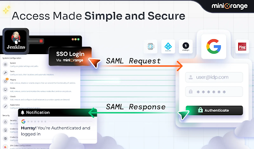

# Jenkins SAML Single Sign-On (SSO) Plugin
Secure, Enterprise-Ready Authentication for Jenkins

---

## 🔐 Multiple IdPs, One Powerful Jenkins Plugin
The **Jenkins SAML Single Sign-On Plugin** enables secure, seamless, role-based authentication for Jenkins using **SAML 2.0**, supporting all major Identity Providers.

---

## ⭐ Why Choose This Plugin?

### 🔁 Sync IdP Groups in Real Time
Automatically sync groups from your IdP to Jenkins for consistent and simplified user management.

### 🚀 Zero-Friction SSO Experience
Users log in once with their corporate IdP—no extra passwords or hassle.

### 🛡️ Enterprise-Grade Security
Signed & encrypted SAML assertions  
IdP-side MFA  
Emergency local login (break-glass access)

### ⚙️ Automated User Provisioning
JIT (Just-in-Time) user creation  
Attribute-based role mapping  
Role-based access control (RBAC)

### 👥 Native User Creation
Create & manage native Jenkins users directly via the plugin—no security realm changes required.

### 🔄 Import / Export Configurations
Easily transfer SAML configurations between Jenkins instances to ensure consistent deployments.

### 🌐 Atlassian Crowd SSO Support
Use Crowd as a central directory, reusing existing groups and authentication flows.

---

## 🆓 Editions

| **Community — Free forever**             | **Premium — 30-day free trial**                     |
|------------------------------------------|-----------------------------------------------------|
| **SAML SSO** + local login fallback      | Just-in-Time **group/role provisioning**            |
| Auto-create users on first login         | Enforce SSO for end users with backdoor URL support |
| Signed & encrypted SAML requests/responses | **Single Logout (SLO)**                             |
| Proxy & load-balancer friendly           | Custom login page                                   |
| Export / import configuration            | **Custom attribute → role mapping**                 |3
|                                          | **Jenkins Local User Management**                   |
|                                          | **Crowd Login Support**                             |
 
---

## ✔️ Supported Identity Providers
ADFS, Azure AD, Azure AD B2C, Keycloak, Okta, Shibboleth, Salesforce, Google Workspace, AWS, Office 365, SimpleSAMLphp, OpenAM, Centrify, RSA, IBM, Oracle, OneLogin, Bittium, WSO2, Auth0, AuthAnvil — **and all SAML 2.0 capable IdPs**

---

## ❓ Frequently Asked Questions (FAQs)

### **Can I create a custom login page for my brand?**
Yes, Jenkins SAML SSO plugin offers you the option to create a custom login template (with logo, text, button) so that your users recognize your IdP immediately and know they’re at the right place!

### **Is the plugin compatible with my setup?**
Jenkins SAML SSO works everywhere.  
Jenkins versions ≥ 2.319.3 (LTS & weekly), Linux, Windows, Docker, Kubernetes.

### **What if I don’t want to enforce SSO for login?**
That’s alright! Jenkins SAML SSO plugin provides you with the flexibility of using native login or enforcing SSO for your end users.  
It also includes emergency local login for break-glass access.

### **Does the Jenkins SAML SSO Plugin support my IdP?**
The Jenkins SAML SSO plugin supports a wide range of IdPs along with all SAML 2.0 capable Identity Providers to cater to all your needs.

**List of supported IdPs:**  
ADFS, Azure AD, Azure AD B2C, Keycloak, Okta, Shibboleth, Salesforce, GSuite/Google Apps, AWS, Office 365, SimpleSAMLphp, OpenAM, Centrify, RSA, IBM, Oracle, OneLogin, Bittium, WSO2, Auth0, AuthAnvil, and all SAML 2.0 capable Identity Providers.
---

## Trusted by Leading Enterprises

#### Mastercard uses Atlassian Crowd with our integration to deliver robust authentication for their Jenkins environment. This setup reinforces access security and contributes to a more resilient overall system.

#### The Bank of Ireland (BOI) leverages our Jenkins SAML SSO Plugin to provide fast, seamless, and reliable Single Sign-On (SSO) for their teams, improving both security and user experience

---

## 📚 Full Setup Guides [here](https://www.miniorange.com/atlassian/jenkins-saml-sso-documentation)

---

## 📞 Contact Us [here](https://miniorange.atlassian.net/servicedesk/customer/portal/2)

----
## ⚡ Quick Start (3 Steps)

### **1. Install via CLI (Jenkins 2.375+)**

### **2. Enable SAML**
Manage Jenkins → Configure Global Security → Security Realm = miniOrange SAML 2.0

### **3. Add IdP Metadata**
Paste metadata URL or upload XML → Save → Test Login 🎉

---

## 🧪 Trial & Licensing
⭐Free **30-day premium trial** — no credit card needed⭐  
Switch between Premium and Community with zero downtime

---

## 🛠️ Support & Troubleshooting

### Enable SAML Logs
1. Sign in as admin → **Manage Jenkins**
2. Scroll to **System Log**
3. Click **Add new Log Recorder** → name it SAMLlogs
4. Add logger: org.miniorange.saml → Level: **FINE**
5. Save
6. Perform a test login
7. Return to logs → copy output
8. Email logs to **support@miniorange.com**

---

## 📞 Need Help?
We’re here 24×7 for licensed customers.  
Email: **atlassiansupport@xecurify.com**

